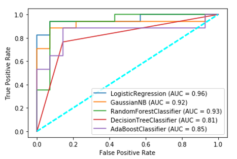

# Cardiovascular Disease Prediction using Machine Learning

In this project, a Multi Class Classification was perofrmed with using 5 Machine Learning Algorithms using 10-Fold Cross Validation. The dataset used is sourced form the [UCI Machine Learning Repository](https://archive.ics.uci.edu/ml/datasets/heart+disease). 

The dataset was processed to check for any missing values, none were found. Data type of each feature was found and Pearson Values were calculated for each feature . Any feature having P-value above 0.1 was not taken into account while training the model 

The dataset was split in a 90:10 ratio and trained and compared on the basis of Accuracy, Sensitivity, Specificity, AUC. Confisuion Matrices and ROC Curve were also plotted
- Logistic Regression
- Naive Bayes
- Decision Trees
- Random Forest Classifier
- AdaBoost

## Getting Started

These instructions will give you a copy of the project up and running on your local machine for development and testing purposes.

### Requirements

- Jupyter
- Python
- Python Libraries
  - Pandas
  - Numpy
  - Scipy
  - Sci-Kit Learn
  - Matplotlib
  - Seaborn
  - Random

## Working 

Accuracy & AUC Comparsion

Sensitivity & Specificity Comparsion

Confusion Matrix Comparison

ROC Comparsion

